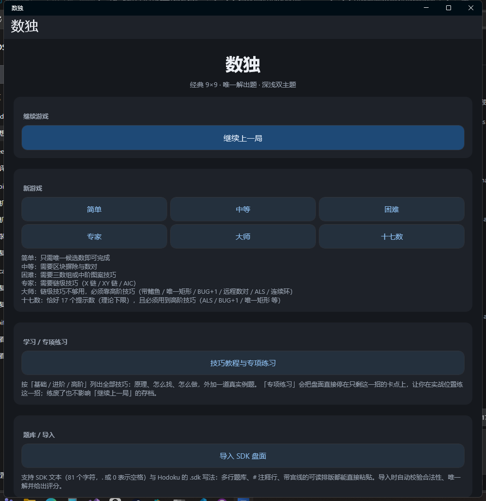
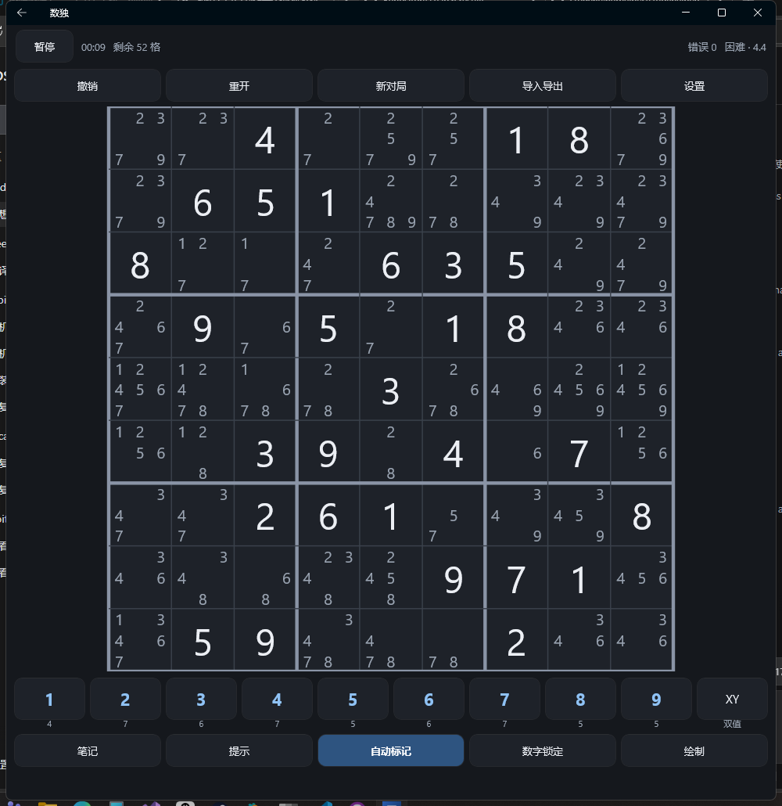
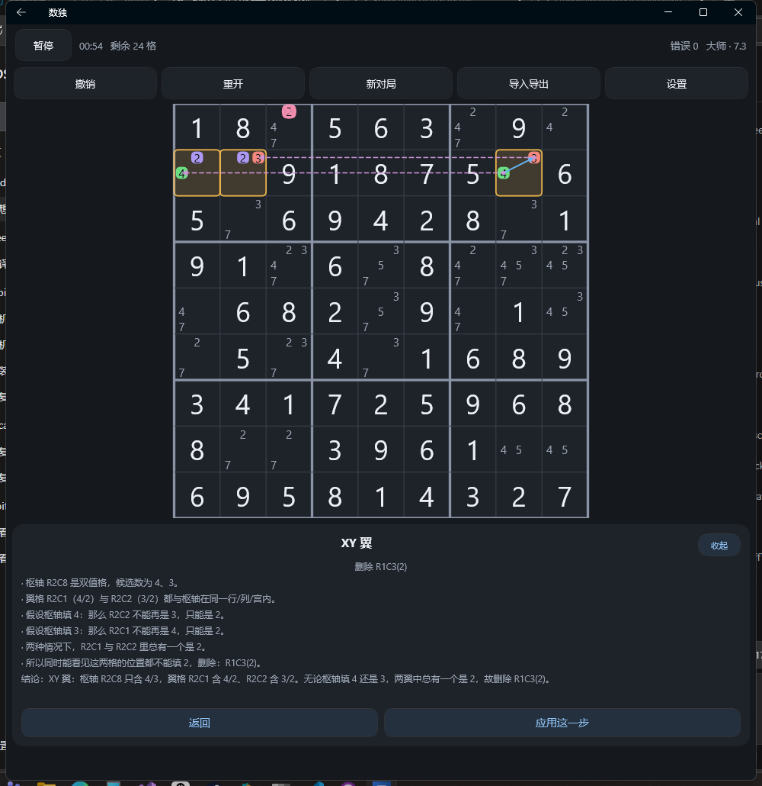
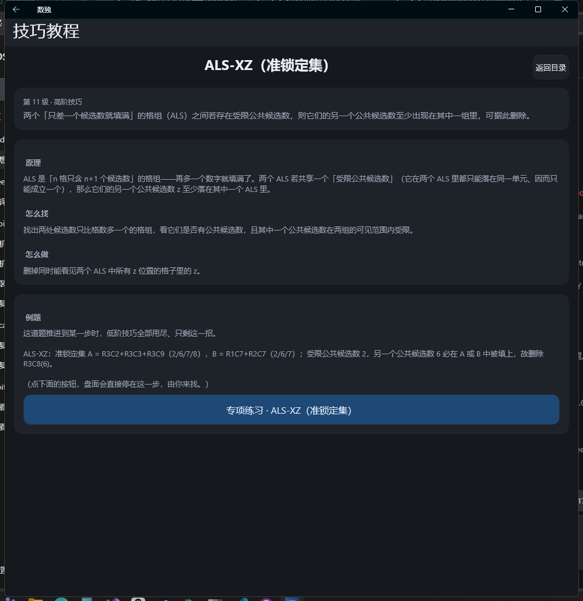
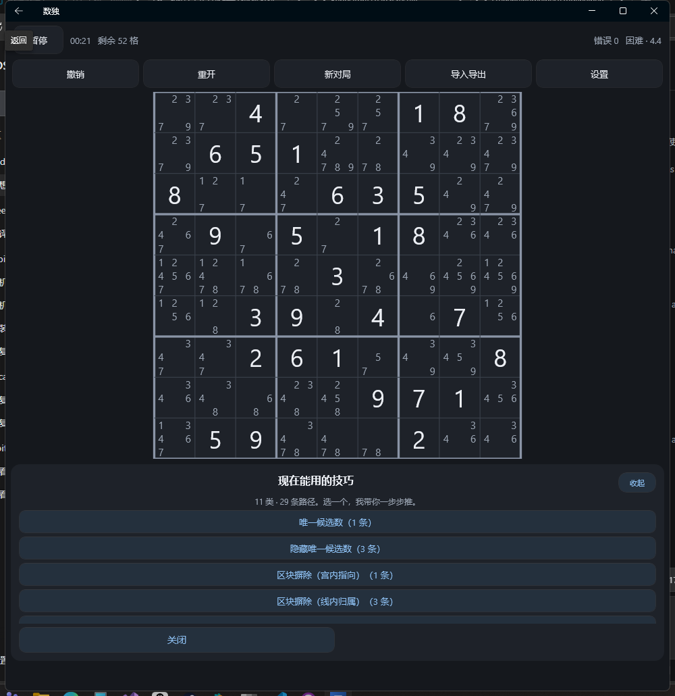
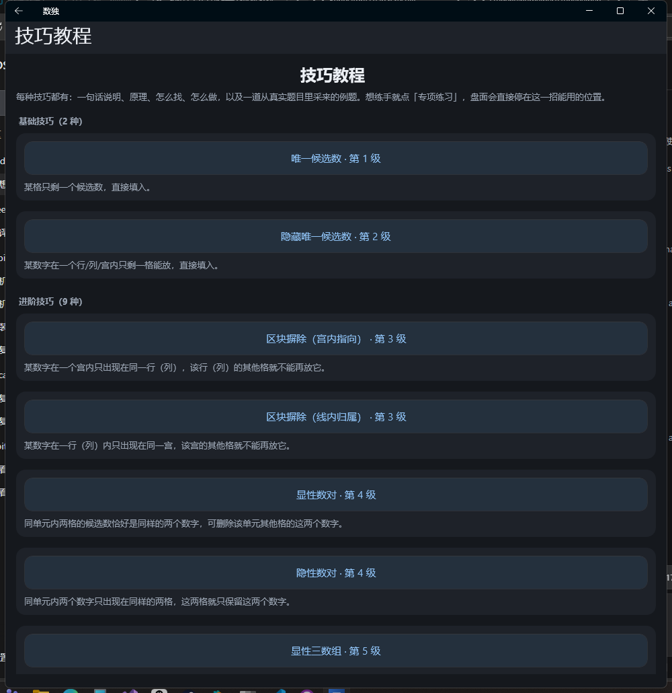

# 数独 · Sudoku

> **一套 .NET MAUI (C#) 代码，同时产出 Windows 桌面版与 Android 版。**
> 出题保证唯一解，难度按**人类解题技巧**判定（不是数已知数个数）；
> 提示会讲清楚这一步用了什么技巧，并把箭头、强弱链、要删的候选数**画在棋盘上**。

[](LICENSE)
[](https://dotnet.microsoft.com/)
[](https://learn.microsoft.com/dotnet/maui/)
[](#下载与安装)
[](#测试)

---

## 界面预览

<table>
<tr>
<td width="50%"><br><sub><b>主菜单</b>：六档难度 + 技巧教程入口</sub></td>
<td width="50%"><br><sub><b>对局</b>：自动标记候选数、数字键剩余数量、锁定数字</sub></td>
</tr>
<tr>
<td width="50%"><br><sub><b>高阶提示</b>：把这一步的推导画在盘面上（结构描边、强/弱链、要删的候选数）</sub></td>
<td width="50%"><br><sub><b>技巧教程</b>：原理 / 怎么找 / 怎么做 / 例题，可直接开专项练习</sub></td>
</tr>
</table>

## 特性

**玩法**

- 六档难度：简单 / 中等 / 困难 / 专家 / **大师** / **十七数**——大师档必须靠高阶技巧才推得下去，
  十七数档只有 17 个提示数（唯一解的理论下限）且同样必须用高阶技巧
- 出题保证**唯一解**；难度由「解题路径上用到过的最难技巧」判定，而不是数提示数
- 自动标记候选数、笔记模式、撤销 / 重做、错误次数上限、计时与剩余格数、逐步自动存档（可「继续上一局」）
- 深浅双主题，可跟随系统

**提示（本项目的主打）**

- 从一个「这一步该填什么」的极简提示，到**列技巧 → 选路径 → 逐步看推导 → 应用**的分段式讲解
- 提示会把这一步的结构画在棋盘上：结构格用描边标出、强链实线带箭头、弱链虚线、
  要删除的候选数红圈打叉；每个标记带「第几步才出现」，跟着「下一步」逐段亮起
- 提示从 1 级「唯一候选数」一路覆盖到 13 级 ALS 链 / 连续环

**学习**

- **技巧教程与专项练习**：23 种技巧每种一页（原理 / 怎么找 / 怎么做 / 真实例题），
  21 种能一键开出专项练习——把盘面走到「低阶技巧全部用尽、只剩这一招」的卡点，让你自己找这一步
- 绘制模式：自己涂色、自己画带箭头的强弱链（6 色、实线强链 / 虚线弱链），用于复盘与推演
- SDK 文本格式导入导出（兼容 Hodoku 的 `.sdk` 习惯），可以把自己的局面发出去、把别人的题拿来玩

## 下载与安装

| 平台 | 产物 | 说明 |
| --- | --- | --- |
| Windows | `Sudoku-win-x64.zip` | 绿色版，解压后双击 `Sudoku.exe` 即用；**自包含**，目标机器无需预装任何运行时 |
| Android | `com.sudoku.app-Signed.apk` | 已签名，拷到手机点击安装（需允许「安装未知应用」） |

构建产物体积较大（Windows 226 MB、APK 28 MB），**不在仓库里**，请到
[Releases](../../releases) 页面下载，或按[从源码构建](#从源码构建)自行打包。

- Windows 压缩包解压后结构：顶层是 4 KB 的启动器 `Sudoku.exe`，程序本体（exe + 400 个运行库）在同目录 `app\`。
  因为 WinUI 的原生 DLL 必须与主 exe 同目录、无法分散存放（也**不能**打成单文件 EXE，实测会启动即崩），
  所以这样收起来，一眼就能看到入口。整个目录拷到任意 Windows 10/11 x64 机器都能跑。
- Android 包名 `com.sudoku.app`，minSdk 21 / targetSdk 36。

## 玩法要点

**棋盘与输入**

- 点格子选中，用下方数字键（或 Windows 键盘 `1`–`9`）填数；`N` 切笔记模式逐个编辑候选数
- **数字锁定**：开启后点数字键即锁定该数字，全盘它的位置与候选数一起高亮；此时点格子就是填这个数字。
  某数字填满 9 个后自动跳到下一个没填完的数字
- **XY 按钮**（数字键最右侧）：青绿描边圈出「恰好只剩两个候选数」的格子，方便找 XY 翼 / 远程数对
- Windows 上在只有一个候选数的格子里**双击**可直接填入

**提示**

设置里的「高阶提示」默认**关闭**：

| 状态 | 行为 |
| --- | --- |
| 关（默认） | 极简提示：直接告诉你某格该填什么 |
| 开 | 列技巧（带条数）→ 选路径 → 逐步看推导 → 「应用这一步」，同时在棋盘上画出这一步 |

「提示技法上限」可以把提示限制在 6 ~ 13 级（例如只想要到 BUG+1 就别开 ALS）。
提示计算候选数时会**扣掉你自己删掉的候选数**（取交集），所以手动排除过之后提示会跟着变。



**绘制模式**（棋盘下方「绘制」或键盘 `L`）

涂色刷格、点两个候选数连线（实线=强链、虚线=弱链、箭头指向落笔方向）、6 色可选、一键清除，
全部可撤销并随存档保存；某格一旦填入数字，与它相关的连线自动清理。

**导入导出**

主菜单「导入 SDK 盘面」或对局页「导入导出」：导入时会依次校验字符集 → 81 个格值 →
合法性（重复数字会指出具体格）→ 是否有解 → 是否唯一解，通过后自动评分并按「题面 + 唯一解」开新局。
支持单行 81 字符（空格用 `.` / `0` / `_` / `*`）、多行题库、`#` 注释、带宫线的可读排版。

## 技巧与难度

内置一个**不做试数**的人类技巧求解器，按技巧难度递增扫盘，共实现 **23 种技巧、1~13 级**：

| 等级 | 技巧 |
| --- | --- |
| 1 ~ 2 | 唯一候选数、隐藏唯一候选数 |
| 3 ~ 5 | 区块摒除、显性/隐性数对、显性/隐性三数组 |
| 6 | X 翼、剑鱼、XY 翼 |
| 7 | X 链（单数字链）、远程数对 |
| 8 | XY 链、唯一矩形、带鳍 X 翼 |
| 9 | 交替推导链 AIC、带鳍剑鱼 |
| 10 | BUG+1（双值通用坟墓） |
| 11 ~ 13 | ALS-XZ（准锁定集）、Sue de Coq（双翼锁定集）、ALS 链、连续环 |

难度采用 **SER（Sudoku Explainer）风格评分**：每种技巧一个基础分，链越长、删得越多小幅加成，
**整题取解题路径上最难的那一步**。六个档位：

| 档位 | 判定口径 | 典型评分 |
| --- | --- | --- |
| 简单 | 只需唯一候选数（≤2） | 1.5 ~ 2.3 |
| 中等 | 需要区块摒除 / 数对（≤4） | 2.6 ~ 3.4 |
| 困难 | 需要三数组、X 翼、剑鱼、XY 翼（≤6） | 3.6 ~ 4.2 |
| 专家 | 需要链级技巧（≥7），但不需要高阶技巧 | 5.0 ~ 7.5 |
| 大师 | 解题路径上**必须**用到高阶技巧 | 5.5 ~ 9.5 |
| 十七数 | 恰好 17 个提示数 **且** 必须用到高阶技巧 | 6.4 ~ 9.2 |

完整的评分表、每种技巧的原理、以及实现里踩过的规则坑（例如 Sue de Coq 的锁定集判定），
见 [`docs/TECHNIQUES.md`](docs/TECHNIQUES.md)。

### 十七数题型

「17 个提示数」是数独唯一解的理论下限。但要说清楚一件事：**绝大多数 17 数题其实是简单题**——
公开的 17 提示数全目录有 49157 道，其中 21932 道只用唯一候选数就能推完。
所以本档额外要求「必须用到高阶技巧」，难度系数不低于大师档：

| 分类 | 道数 |
| --- | --- |
| 全目录（`acs40/sudoku-17-clues`） | 49157 |
| 用到高阶技巧 | 2932 |
| **纯逻辑可解且用到高阶技巧（＝本档题库来源）** | **1915** |

从这 1915 道里按最难技巧分组各取 4 道，内置 24 道母题（ALS 链 / ALS-XZ / BUG+1 / 唯一矩形 /
带鳍 X 翼 / 远程数对），出题时做等价变换（换数字、换行带列带、带内换行换列、可选转置）——
这些变换保持解的个数、提示数个数与难度不变。单元测试会在每次构建时逐条把关这些母题，
另有一条反向测试：只用唯一候选数就能推完的经典 17 数题**不允许**被评为「十七数」。

### 技巧教程与专项练习

主菜单「技巧教程与专项练习」按 基础（≤2 级）/ 进阶（3~6 级）/ 高阶（≥7 级）分组，
每种技巧一页：一句话说明 + 原理 + 怎么找 + 怎么做 + 一道真实例题。
点「专项练习」会把例题题面按人类走法推进到「低阶技巧全部用尽、只剩这一招」的卡点，
你从那里开始自己找这一步；练习局不写存档，也不会覆盖「继续上一局」。

> 23 种技巧里 21 种有例题可练；**带鳍剑鱼**与 **BUG+1** 在 1800+ 道真实题面里一次都没出现过，
> 教程页对它们给出无例题的降级说明。



## Windows 快捷键

| 按键 | 作用 | 按键 | 作用 |
| --- | --- | --- | --- |
| `1`–`9` | 填入数字（笔记模式下切换候选数） | `Z` | 撤销 |
| `Backspace` / `Delete` / `0` | 清除当前格 | `Y` | 重做（界面上没有这个按钮） |
| `↑` `↓` `←` `→` | 移动选格 | `H` | 提示 |
| `N` | 切换笔记模式 | `P` | 暂停 / 继续 |
| `L` | 进出绘制模式 | `T` | 绘制模式内：涂色 / 画链 切换 |
| `K` | 绘制模式内：强链 / 弱链 切换 | | |

## 从源码构建

需要 Windows 10 1809+ 与 PowerShell；**不需要预装 .NET**（SDK 装在仓库内的 `.toolchain/`，不入库）。

```powershell
# 首次：安装项目内 .NET 10 SDK + MAUI workload（约 2~4 GB）
pwsh -File scripts\install-toolchain.ps1

# 每次开新终端后启用项目内 SDK
. .\scripts\dev-env.ps1

# 跑测试 / 直接运行 / 打包
.\scripts\test.ps1                    # 165 个单元测试
.\scripts\run-windows.ps1             # 构建并启动 Windows 版
.\scripts\publish-windows.ps1 -Zip    # 发布绿色版 exe + ZIP
.\scripts\build-android.ps1           # 构建 Android APK（首次会自动装 Android SDK）
.\scripts\install-apk.ps1             # adb 安装到手机并启动
```

Android 签名用的密钥库与口令**都不入库**，口令按「命令行参数 → 环境变量 → 本地私有文件
`scripts/local-signing.ps1`」的优先级提供；都没有时会明确警告并改为产出未签名 APK。
细节见 [`docs/BUILD.md`](docs/BUILD.md) 与 [`keystore/README.md`](keystore/README.md)。

## 项目结构

```
Sudoku.slnx                  解决方案
Sudoku.Core/                 纯逻辑类库（无 UI 依赖，可单独单元测试）
  SudokuGrid.cs / Board.cs   行列宫拓扑、位掩码、盘面模型与候选数
  Solver.cs                  回溯求解器（唯一解校验 / 求答案）
  LogicalSolver.cs           人类技巧求解器（难度判定 + 提示引擎地基）
  ChainTechniques.cs         链级技巧（X 链 / XY 链 / AIC）与强弱链模型
  FinnedFish.cs              X 翼 / 剑鱼 / 带鳍鱼
  UniqueRectangle.cs         BUG+1.cs  远程数对 / 唯一矩形 / BUG+1
  AlsTechniques.cs           SueDeCoq.cs  ContinuousLoop.cs   ALS / 连续环等高阶技巧
  HintPlanner.cs             提示编排（列技巧 → 选路径 → 分步推导）
  HintMarks.cs               提示高亮的标记模型（角色 + 分步渐显）
  Difficulty.cs              难度档位   DifficultyRating.cs  SER 风格评分
  Generator.cs               终盘生成 + 唯一解挖洞 + 难度校准 + 十七数出题
  SeventeenClues.cs          十七数题库（24 道高阶母题 + 等价变换）
  TechniqueLessons.cs        技巧教程与专项练习内容
  SdkFormat.cs               SDK 文本导入导出   LinkDrawing.cs / CellColoring.cs  手绘数据
Sudoku.Core.Tests/           165 个单元测试（xunit）
Sudoku.App/                  MAUI 应用（Android + Windows）
  Views/                     主菜单、对局页、设置页、教程页、SDK 导入导出页、控件工厂
  Game/                      对局状态机、设置、存档
  Drawing/                   棋盘矢量绘制层（网格、候选数、高亮、连线、提示标记）
scripts/                     一键脚本（工具链 / 测试 / 运行 / 发布 / 打包 / 安装）
docs/                        构建、技巧与评分、界面设计笔记与界面截图
keystore/                    签名密钥库说明（密钥本体不入库）
```

## 测试

```powershell
. .\scripts\dev-env.ps1
.\scripts\test.ps1
```

165 个单元测试覆盖：盘面与拓扑、求解器唯一解、每种技巧的推导结构与「**绝不误删真实候选数**」不变量、
难度评分与档位、提示编排、提示标记分色与分步切片、SDK 文本导入导出的各种边界
（含 Windows `\r` 换行这个真实踩过的坑）、十七数母题的「17 提示数 + 唯一解 + 必须用高阶技巧」、
以及教程卡点的可复现性。

UI 侧用「UI 自动化读控件几何 + 截图像素统计 + 存档核对」交叉验证，记录在
[`CHANGELOG.md`](CHANGELOG.md)。

## 文档

| 文档 | 内容 |
| --- | --- |
| [`docs/TECHNIQUES.md`](docs/TECHNIQUES.md) | 23 种技巧的原理、SER 评分表、六档判定、十七数语料统计与筛选口径、实现踩过的规则坑 |
| [`docs/DESIGN.md`](docs/DESIGN.md) | 界面布局规则、提示高亮分色、绘制模式与优先级、设置项清单、验证方法 |
| [`docs/BUILD.md`](docs/BUILD.md) | 环境要求、脚本用法、Windows / Android 构建与签名、产物校验、常见问题 |
| [`CHANGELOG.md`](CHANGELOG.md) | 各阶段的开发记录与实测数据 |

## 已知限制

- Android 版**尚未在真机上完整验证**（静态校验通过：签名、包名、minSdk/targetSdk、zipalign 对齐）。
- 存档是 JSON 快照，**没有版本号迁移机制**，跨大版本升级后旧存档可能读不出来。
- Windows 绿色版 226 MB 里绝大部分是自包含的 .NET 运行时与 Windows App SDK；WinUI 3 不支持单文件部署，
  想更小只能改成依赖已安装运行时的发布方式。
- 教程里带鳍剑鱼与 BUG+1 没有例题（真实题面里几乎不出现）。
- 专项练习的卡点是**运行时走出来的**（要求用全新候选数也能复现这一招），因此技巧代码改动后仍有效；
  但也意味着它会跟着求解器行为变化，而不是固定题库。

## 致谢与许可

- 参考实现思路来自 [Hodoku](https://hodoku.sourceforge.net/)（Java 开源解谜教学器）。
  Hodoku 采用 GPL-3，本项目**只参考其行为与术语，代码全部自行实现**，不引入任何 GPL 代码。
- 十七数题库的母题取自公开数据集 [`acs40/sudoku-17-clues`](https://github.com/acs40/sudoku-17-clues)。
- 字体使用 MAUI 模板自带的 OpenSans。

本项目以 [MIT License](LICENSE) 开源，Copyright (c) 2026 wyq。
